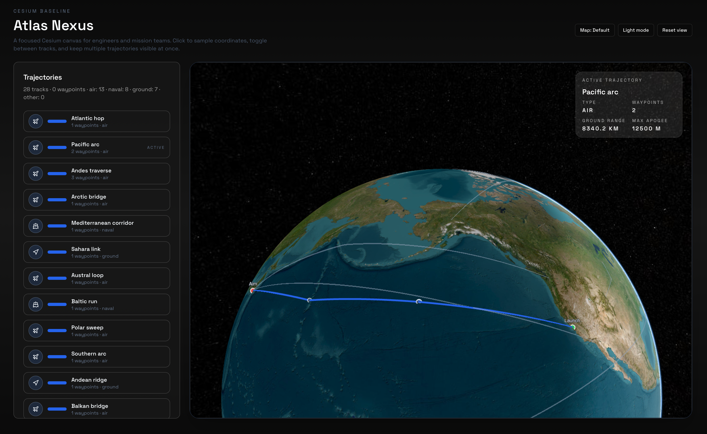

# Atlas Nexus

Clean Cesium + Vite/Vue viewer for exploring trajectories with a minimal HUD.



## Features

- Cesium globe with stripped-down controls and Natural Earth II/ArcGIS base layers
- Click-to-sample coordinates with an on-globe marker and overlay
- Trajectory highlighting with waypoint markers (start/end/waypoint) and summary stats
- Dark/Light theme toggle with neutral, low-noise styling
- Load additional trajectories from JSON (`public/data/trajectories-extra.json`)

## Getting started

```bash
npm install
npm run dev
```

## Useful scripts

- `npm run dev` – start Vite dev server
- `npm run build` – production build
- `npm run preview` – preview the production build
- `npm run copy:naturalearth2` – copy Cesium Natural Earth II assets into `public/cesium` (run once after install if you want offline Natural Earth II)

To enable Natural Earth II offline:

```bash
npm install
npm run copy:naturalearth2
npm run dev
```

## Trajectory data format

```json
{
  "id": "unique-id",
  "name": "Readable name",
  "type": "air | naval | ground | other",
  "positions": [
    { "lat": 0, "lon": 0, "height": 0 },
    { "lat": 1, "lon": 1, "height": 1000 }
  ],
  "waypoints": [
    { "lat": 1, "lon": 1, "height": 1000 }
  ]
}
```

- `positions` define the full path.
- `waypoints` (optional) mark intermediate points to render markers; start/end are derived from the first/last positions.

## Notes

- To swap the placeholder image, replace `docs/atlas-nexus-placeholder.png` with your screenshot and adjust the README reference.
- Natural Earth II assets are loaded from `public/cesium/NaturalEarthII`; run the copy script if needed.

## License

MIT
